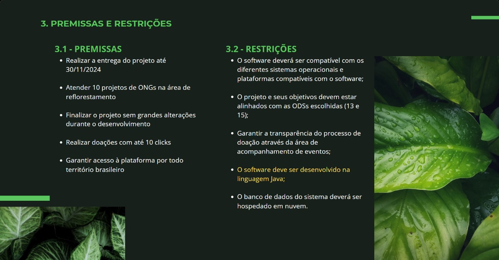

# Testing-IA-DIO
Olá, sejam bem-vindos ao meu repositório de mais um Desafio da DIO.me! Haha

# Introduzindo o contexto
Neste desafio, tive a tarefa de pesquisar algumas IAs e realizar alguns testes para entender seu funcionamento e como podemos aplicar esse conhecimnento no dia a dia.

## ADA AI
A ada é um assistente virtual em formato de chat que pode ser treinada através de ordens, regras e leituras de sites html. Alimentei a ferramenta com o site da minha empresa e com isso obtive alguns resultados interessantes para algumas perguntas. Deem uma olhada:

  

  

## Gamma AI
Ao pesquiasar algumas IAs que poderiam ser interessantes para o meu dia a dia, cheguei até a solução da Gamma. Simplesmente é uma IA generativa que trás pra gente a possibilidade de montar apresentações em slides completas e editáveis. Na disciplina de qualidade de software temos apresentações semanais para fazer e essa IA tem nos ajudado muito!

  

  

